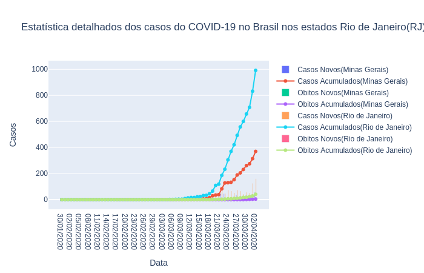

# COVID-19Stats
## Requisitos
* Firefox 75.0 [Download](https://www.mozilla.org/pt-BR/firefox/new/)
* Geckodriver 0.26.0 [[Download](https://stackoverflow.com/a/40392714), [Tutorial](https://github.com/mozilla/geckodriver/releases/tag/v0.26.0)]
* Ubuntu 20.04 LTS [Download](https://ubuntu.com/)
* Pipenv 2018.11.26 [Download](https://pipenv.pypa.io/en/latest/install/#installing-pipenv)
* Python 3.8.2 [Download](https://www.python.org/downloads/)

## Gráficos

## Como instalar
### Considerando que o Pipenv já esteja instalado
* Abra o terminal na mesma pasta em que os arquivos do repositório estão;
* Execute o comando `pipenv install` na mesma pasta onde os arquivos desse repositório estão e todos os pacotes necessários serão instalados automaticamente(pode demorar dependendo da sua internet);

### Se somente quiser acessar os dados de forma interativa
* Execute o script `pipenv run python3 main.py`;

### Se somente quiser gerar os dados
* Execute o script `pipenv run python3 gerarDados.py`

## Observações

